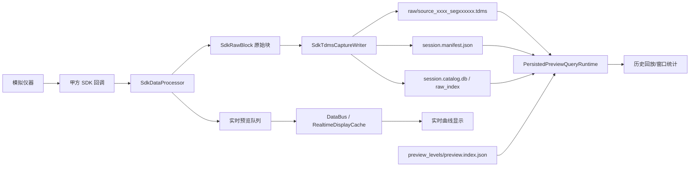
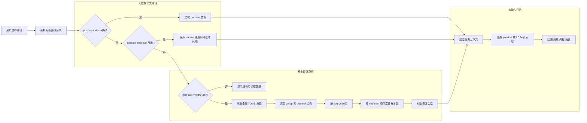

# DH-master SDK采集、存储与显示模块详细设计方案

**项目名称**：DH-master 数据采集与显示系统  
**文档类型**：详细设计方案  
**设计范围**：SDK 回调采集、实时存储、实时显示、历史查询与故障恢复  
**参考模板**：《数据采集模块详细设计.pdf》  
**文档日期**：2026-05-09  

---

## 文档信息

本文档聚焦本项目当前主链路：

1. 通过甲方 SDK 接收模拟仪器回调数据。
2. 将回调数据快速转换为项目内部数据块。
3. 对原始数据进行高性能持续写盘。
4. 同时向实时显示链路发布低优先级预览数据。
5. 通过索引、manifest、catalog 与 preview sidecar 支撑历史快速查询。
6. 针对掉电、磁盘坏道、文件不完整、写盘阻塞等风险给出架构应对。

不展开 TCP 调试链路、算法编排工作台、旧 UI 实验控件等非主线功能。

---

## 1. 模块概述

### 1.1 模块名称

SDK 数据采集、存储与显示模块。

### 1.2 模块职责

本模块负责从模拟仪器 SDK 回调入口接收高速采样数据，并完成以下工作：

- SDK 初始化、设备发现、采样启停与状态监控。
- SDK callback 数据接收、原始块封装、实时预览发布。
- 原始采样数据持续写入物理 `.tdms` source/segment 文件。
- 写入 `session.manifest.json`、`session.catalog.db`、raw index、preview index 等会话元数据。
- 为实时显示提供内存缓存与外部 frame snapshot。
- 为历史回放提供基于时间窗和通道集合的查询能力。
- 在掉电、异常退出、磁盘异常、文件缺失或索引不一致时提供可检测、可隔离、可恢复的机制。

### 1.3 模块依赖

| 层级 | 主要项目/目录 | 说明 |
| --- | --- | --- |
| 合同与模型层 | `src/DH.Contracts` | 定义 `IDataBus`、`IDataFrame`、`IAlgorithm`、`CurvePoint`、`SimpleFrame`、`ChannelIdentifier` 等基础契约 |
| SDK 驱动层 | `src/DH.Driver/SDK` | `SdkDataProcessor`、`SdkDriverManager`、`HardwareSDK`、`SdkRawBlock` 等 SDK 接入与回调处理 |
| 数据总线层 | `src/DH.Client.App/Data`、`src/DH.Datamanage` | 实时 frame 发布、通道缓存、预览点生成 |
| 存储层 | `src/DH.Client.App/Services/Storage` | TDMS 写入、manifest/catalog/index/preview sidecar、压缩与校验 |
| 查询层 | `src/DH.Client.App/Data/Query` | `ICurveQueryService`、`PersistedPreviewQueryRuntime`、实时/历史查询模型 |
| UI 显示层 | `src/DH.Client.App/Views`、`src/DH.Client.App/controls` | 多视图曲线显示、TDMS 回放查看、性能指标记录 |

### 1.4 模块被依赖

| 调用方 | 依赖内容 |
| --- | --- |
| 主窗口 ViewModel | 调用 SDK 初始化、启动采样、停止采样、启动/停止存储 |
| 实时结果页 | 消费外部 frame snapshot 和实时缓存 |
| TDMS 查看/回放页面 | 通过查询层读取 session artifacts 和 `.tdms` 数据 |
| 性能与验证工具 | 读取写盘日志、preview/raw index、查询结果和验证报告 |

---

## 2. 功能设计

### 2.1 总体数据流



### 2.2 SDK 数据采集流程

采集流程以 `SdkDriverManager` 为 UI 侧统一入口，内部委托 `SdkDataProcessor` 完成 SDK 生命周期管理。

1. UI 设置 SDK 配置路径。
2. `SdkDriverManager.Initialize()` 调用 `SdkDataProcessor.Initialize()`。
3. `SdkDataProcessor` 加载 SDK 动态库、释放旧 SDK 实例、注册回调委托。
4. SDK 连接模拟仪器并读取在线设备数量、通道数量、采样率等信息。
5. 用户启动采样后，SDK 开始持续触发数据回调。
6. 回调线程只执行快路径工作：拷贝/封装、记录元数据、入队、返回。
7. 原始块进入存储写入队列，实时预览进入独立低优先级队列。

### 2.3 数据打包逻辑

SDK 回调数据被封装为内部原始块，主要保留以下信息：

| 字段 | 说明 |
| --- | --- |
| `GroupId` / `MachineId` | SDK 回调侧设备标识 |
| `ChannelCount` | 本次回调包含的通道数量 |
| `PayloadBytes` | 原始 payload 字节数 |
| `StartSampleIndex` | 起始样本序号 |
| `SampleRateHz` | 采样率 |
| `DeviceTimestamp` / `HostTimestamp` | 设备时间与主机接收时间 |

内部通道命名通过 `ChannelNaming.GetDeviceId()` 等规则将 source、channel 映射为稳定的全局通道编号，确保存储、显示、索引、回放使用同一套通道语义。

### 2.4 实时显示模式

实时显示不直接读取正在写入的文件，而是走内存链路：

1. `SdkDataProcessor` 将回调数据拆分为通道 frame。
2. frame 发布到 `DataBus`。
3. `RealtimeDisplayCache` / `RealtimeSweepSnapshotCache` 维护最近窗口。
4. `MainWindow` 统一构建 `RealtimeCurveFrameSnapshot`。
5. `CurvePanel` 只消费外部 frame snapshot 进行绘制。

设计约束：

- UI 不阻塞 SDK callback。
- UI 不阻塞 TDMS 写盘队列。
- 实时预览可降级、可跳帧、可丢弃中间预览块。
- 曲线真实点数与渲染预算分开统计，不能把 `4000` 当作真实点数上限。

### 2.5 历史查询模式

历史查询由 `PersistedPreviewQueryRuntime` 负责。查询入口统一使用：

- `ICurveQueryService.QueryAsync(PreviewReadRequest)`
- `ICurveFrameProvider.GetLatestAsync(PreviewReadRequest)`
- `ICurveStatisticsService.QueryStatisticsAsync(CurveStatisticsRequest)`

查询层根据窗口大小和可用 artifacts 自动选择：

| 层级 | 说明 | 用途 |
| --- | --- | --- |
| `L4` | 最粗 preview | 全时长总览 |
| `L3` | 粗 preview | 大窗口快速浏览 |
| `L2` | 中等 preview | 中窗口缩放 |
| `L1` | 细 preview | 秒级窗口预览 |
| `L0` | 原始 TDMS 局部读取 | 小窗口精确明细与统计 |

历史回放不允许默认整通道读取大文件，必须通过 manifest/catalog/index 先定位 segment，再进行范围读取。

---

## 3. 接口设计

### 3.1 SDK 驱动管理接口

`SdkDriverManager` 对 UI 暴露的核心能力：

| 成员 | 说明 |
| --- | --- |
| `Initialize(string configPath)` | 初始化 SDK，加载配置并连接设备 |
| `StartSampling()` | 启动采样 |
| `StopSampling()` | 停止采样 |
| `SetRealtimePublishEnabled(bool enabled)` | 控制是否向实时显示链路发布预览 |
| `RawBlockReceived` | 原始块旁路事件，供存储 writer 消费 |
| `OnlineDeviceCount` | 在线设备数量 |
| `TotalChannelCount` | 总通道数量 |
| `SampleRate` | 当前采样率 |

### 3.2 实时数据总线接口

`IDataBus` 是实时 frame 发布和订阅的基础接口：

```csharp
public interface IDataBus
{
    IAsyncEnumerable<IDataFrame> SubscribeChannel(int channelId, CancellationToken ct = default);
    ValueTask PublishFrameAsync(IDataFrame frame, CancellationToken ct = default);
    IAsyncEnumerable<IDataFrame> SubscribeAll(CancellationToken token);
    void EnsureChannel(int channelId);
}
```

`IDataFrame` 的主要信息包括：

| 字段 | 说明 |
| --- | --- |
| `FrameId` | frame 序号 |
| `Timestamp` | 主机侧时间戳 |
| `ChannelId` | 通道编号 |
| `Samples` | 单通道样本数据 |
| `Header.SampleRate` | 采样率 |
| `Header.StartSampleIndex` | 起始样本序号 |
| `Header.SampleIntervalSeconds` | 样本间隔 |

### 3.3 存储写入接口

`SdkTdmsCaptureWriter` 是 SDK 采集主线的存储写入器。

| 方法/属性 | 说明 |
| --- | --- |
| `Start(basePath, sessionName, sampleRateHz, expectedChannelIds, compressionSettings)` | 创建 session 目录、raw 目录、artifacts 目录并启动后台 writer |
| `TryEnqueue(SdkRawBlock rawBlock)` | 将 SDK 原始块提交到写盘链路 |
| `ProtectionTriggered` | 写盘保护是否触发 |
| `Stop/Dispose` | drain 队列、关闭 segment、写 manifest/catalog |

写入产物：

| 文件/目录 | 说明 |
| --- | --- |
| `raw/source_0000_seg000001.tdms` | 按 source 和 segment 切分的物理 TDMS 原始数据 |
| `<session>.artifacts/session.manifest.json` | 会话元数据、source 列表、segment 时间线 |
| `<session>.artifacts/session.catalog.db` | SQLite catalog，记录 session、sources、segments、preview 映射 |
| `<session>.artifacts/raw_index/` | 原始数据按通道/时间窗快速定位索引 |
| `<session>.artifacts/preview_levels/` | 离线或后台生成的多级 preview sidecar |
| `<session>.artifacts/storage.compression.json` | 存储压缩配置快照 |

### 3.4 查询接口

```csharp
public interface ICurveQueryService
{
    ValueTask<CurveWindowSnapshot> QueryAsync(
        PreviewReadRequest request,
        CancellationToken ct = default);
}
```

`PreviewReadRequest` 关键字段：

| 字段 | 说明 |
| --- | --- |
| `SessionId` | 会话 ID |
| `ViewId` | 视图 ID |
| `SourceIds` | source 过滤 |
| `ChannelIds` | 通道集合 |
| `WindowStart` / `WindowEnd` | 查询时间窗 |
| `PreviewLevel` | 请求层级 |
| `MaxPointsPerChannel` | 每通道返回点预算 |
| `RequireEnvelopeSemantics` | 是否要求包络语义 |
| `AllowDegradedResult` | 是否允许降级返回 |

`CurveWindowSnapshot` 关键字段：

| 字段 | 说明 |
| --- | --- |
| `ChannelData` | 通道到曲线点集合的映射 |
| `PreviewLevel` | 实际返回层级 |
| `IsPreview` | 是否为 preview 数据 |
| `IsComplete` | 时间窗是否完整 |
| `BuildState` | `Ready/Building/Degraded/Missing` |
| `MaxActualPointsPerChannel` | 每通道真实点数 |
| `TotalActualPoints` | 总真实点数 |

---

## 4. 实现细节

### 4.1 SDK callback 快路径

SDK callback 是最高优先级路径，禁止执行高成本逻辑。

允许操作：

- 复制 SDK buffer。
- 生成 `SdkRawBlock`。
- 写入原始块队列。
- 将少量预览数据提交到实时预览队列。
- 记录必要的计数和时间戳。

禁止操作：

- 文件写入。
- TDMS 保存。
- 压缩。
- 复杂算法处理。
- UI 刷新。
- 等待查询结果。

### 4.2 高性能存储设计

当前主线采用 source-sharded、segment-based 的物理 TDMS 直写策略。

设计要点：

1. 按 source 创建独立 writer，避免跨设备大拼帧。
2. 按时间或大小切分 segment，减少单文件过大导致的关闭和恢复成本。
3. TDMS 写入采用后台 segment writer，SDK callback 不直接写盘。
4. 默认关闭采集热路径 preview sidecar，避免 preview 构建拖慢写盘。
5. 压缩请求默认不进入采集热路径，高吞吐场景下转为后台压缩或录后处理。
6. 写盘队列设置保护阈值，超过阈值时触发保护，停止继续接收，避免内存被无限占用。

当前代码中已有的关键保护参数包括：

| 参数 | 作用 |
| --- | --- |
| `MaxPendingBlockLimit` | 原始块积压数量上限 |
| `MaxPendingPayloadByteLimit` | 原始块积压字节上限 |
| `MaxPendingSegmentLimit` | 待写 TDMS segment 数量上限 |
| `MaxPendingSegmentPayloadByteLimit` | 待写 segment 总字节上限 |
| `EnableCapturePreviewSidecar=false` | 默认不在采集热路径同步构建 preview |

### 4.3 文件组织设计

推荐 session 目录结构：

```text
data/
  session_yyyyMMdd_HHmmss_xxx/
    raw/
      source_0000_seg000001.tdms
      source_0000_seg000002.tdms
      source_0001_seg000001.tdms
    compressed/
      ...
    tdms-capture-writer.log
    session_xxx.artifacts/
      session.manifest.json
      session.catalog.db
      storage.compression.json
      raw_index/
        raw.index.json
        CH0001.raw.index.bin
      preview_levels/
        preview.index.json
        L2_CH0001.preview.bin
```

`AppDataPaths` 统一解析数据根目录：

- 默认使用仓库根目录下 `data`。
- 可通过环境变量 `DH_DATA_ROOT` 指定高速盘目录。
- 避免因为启动目录不同把数据写入 `bin/data`。

### 4.4 查询性能设计

查询性能不依赖一次性读完整文件，而依赖以下组合：

1. `session.manifest.json` 快速获取 session、source、segment 时间线。
2. `session.catalog.db` 快速定位 source、segment、preview 映射。
3. `raw_index` 支持按通道和样本范围读取 L0 原始数据。
4. `preview.index.json` 支持按层级和窗口定位 preview bucket。
5. TDMS L0 读取通过 raw data offset 和通道序号做局部 seek。

查询流程：

1. UI 发出 `PreviewReadRequest`。
2. 查询层校验 session、时间窗、通道集合。
3. 根据窗口跨度选择 `L4 -> L3 -> L2 -> L1 -> L0`。
4. 读取 preview 或 raw segment。
5. 按 `MaxPointsPerChannel` 执行包络输出。
6. 返回 `CurveWindowSnapshot`，显式标记是否完整、是否降级、实际点数。

### 4.5 线程安全说明

| 线程/任务 | 职责 | 线程安全策略 |
| --- | --- | --- |
| SDK callback 线程 | 接收原始数据 | 快进快出，不等待 UI 和写盘 |
| 实时预览 pump | 低优先级发布预览 frame | bounded channel，允许限流和丢弃 |
| TDMS segment writer | 后台写物理 TDMS 文件 | 独立队列，保护阈值，异常记录 |
| UI 线程 | 显示和交互 | 不做文件读取和高成本转换 |
| 查询任务 | 历史窗口读取 | 异步、可取消、按 segment 范围读取 |

### 4.6 断电恢复详细设计

断电恢复设计目标是：在主机掉电、进程被强制关闭或 UI 异常退出时，已经成功落盘并关闭的 TDMS segment 仍可被再次打开、查看、查询和绘图；未完成的 manifest、catalog、preview index 不应导致整个 session 不可用。

#### 4.6.1 故障模型

断电场景下可能出现以下文件状态：

| 文件/目录 | 可能状态 | 恢复策略 |
| --- | --- | --- |
| `raw/source_XXXX_segYYYYYY.tdms` | 多数已完整关闭，最后一个 segment 可能不完整 | 优先读取可解析 segment，跳过不可读 segment |
| `<session>.artifacts/session.manifest.json` | 尚未生成或写入中断 | 不依赖 manifest，改为扫描 raw TDMS 恢复 |
| `<session>.artifacts/session.catalog.db` | 未生成、空文件或事务未完成 | catalog 失败时回退 manifest；manifest 也缺失时回退 raw TDMS |
| `raw_index/` | 未生成或部分生成 | L0 查询直接按 TDMS segment 局部读取 |
| `preview_levels/` | 未生成或部分生成 | 打开时先显示 raw 恢复摘要，后续可离线补建 preview |
| `tdms-capture-writer.log` | 最后日志停留在 enqueue/write 阶段 | 作为诊断依据，不作为唯一恢复依据 |

#### 4.6.2 写入侧约束

为了支持断电恢复，写入侧遵循以下约束：

1. 原始数据优先落入 `raw/source_XXXX_segYYYYYY.tdms`，segment 是最小可恢复单元。
2. TDMS segment 命名必须包含 source 和 segment index，便于无 manifest 时重建时间线。
3. 单个 segment 控制在可接受大小，避免断电时单文件损失过大。
4. manifest/catalog/preview 属于索引和元数据层，不能成为原始数据可读性的唯一入口。
5. 停止采集时执行 drain、flush、close、manifest 写入；异常退出时允许 manifest 缺失。
6. 压缩 segment 必须写入原始样本数、压缩算法、预处理算法、payload 字节数等属性，保证恢复查询能够定位通道数据。

#### 4.6.3 打开侧恢复流程

用户打开 session 目录、`.artifacts` 目录、`raw` 目录或任意 `source_*.tdms` 文件时，TDMS 查看页面按以下顺序解析：



恢复逻辑不再使用“第一个 TDMS 文件”作为整个 session 的代表，而是扫描所有 `raw/source_*_seg*.tdms` 文件：

- group 名按 `source_0000`、`source_0001` 等格式识别。
- channel 名按 `AI0001`、`AI0101` 等格式解析为全局 channel id。
- source 列表由实际存在的 TDMS group 重建。
- 每个 source 内按 segment index 排序。
- 样本时间轴按同一 source 已读样本数累计，而不是简单使用 `segmentIndex * 当前段长度`。

最后一条规则用于处理断电常见的“最后一个 segment 是短段”的情况。如果用短段长度反推前面所有 segment 的起点，会导致时间轴错位；按累计样本数重建可以避免该问题。

#### 4.6.4 恢复会话描述

当 manifest 缺失但 raw TDMS 存在时，查询层构造临时 `SessionDescriptor`：

| 字段 | 恢复来源 |
| --- | --- |
| `SessionId` | 启动时生成临时 GUID |
| `TaskName` | session 目录名 |
| `StartTime` | 最早 TDMS 文件创建时间 |
| `StorageFormat` | `tdms-source-segment-recovered` |
| `Recovered` | `true` |
| `Sources` | 扫描 TDMS group/channel 后生成 |
| `PreviewLevels` | 空集合，表示当前没有 preview index |

该恢复会话只用于打开、绘图、查询和统计，不反向伪造已完成的 manifest。后续如需长期固化，可由离线修复工具重新生成 manifest/catalog/preview。

#### 4.6.5 样本数与采样率恢复

恢复路径优先使用轻量信息，避免打开大文件时整通道读取：

1. 压缩 segment：读取 `dh_original_sample_count` 属性作为原始样本数。
2. 未压缩 segment：读取 TDMS raw data offset，结合文件长度、通道数和 `sizeof(float)` 估算每通道样本数。
3. 采样率：优先读取 `wf_increment`，计算 `sampleRateHz = 1 / wf_increment`。
4. 属性读取失败但文件结构可识别时，按当前系统主链路默认 `1MHz` 兜底。
5. 某个 segment 结构不可读时跳过该 segment，并保持其他健康 segment 可查询。

#### 4.6.6 查询与显示降级策略

恢复会话的查询策略如下：

| 条件 | 查询策略 |
| --- | --- |
| 有 preview index | 优先使用 L1-L4 preview |
| 有 manifest 但无 preview | 使用 manifest 中的 TDMS timeline 进行 L0 局部读取 |
| 无 manifest 但有 raw TDMS | 扫描 raw TDMS 重建 timeline 后执行 L0 局部读取 |
| 单个 segment 损坏 | 跳过损坏 segment，返回 `Degraded` 或不完整窗口 |
| 所选通道不存在 | 返回空通道数据，不影响其他通道 |

UI 层需要明确区分：

- 完整 session：manifest/catalog/preview 正常。
- 恢复 session：raw TDMS 可读，但 manifest/catalog/preview 缺失。
- 损坏 session：raw TDMS 也无法建立通道表或时间轴。

恢复 session 可以正常选择 source、通道、时间窗，并支持单光标、双光标和统计功能；但全时长总览若没有 preview index，将由 L0 恢复摘要支撑初始时间范围，后续可提示用户离线补建 preview 以提升超大数据浏览性能。

---

## 5. 使用示例

### 5.1 基本采集与存储流程

1. 用户在 UI 中设置 SDK 配置路径。
2. 点击初始化 SDK。
3. SDK 返回在线设备数、通道数、采样率。
4. 用户设置存储目录、session 名称、压缩策略。
5. 点击开始存储，`SdkTdmsCaptureWriter.Start()` 创建 session。
6. 点击开始采样，SDK callback 开始产生 `SdkRawBlock`。
7. 原始块进入 TDMS 写盘队列，实时预览进入 DataBus。
8. UI 实时显示最近窗口曲线。
9. 用户停止采样。
10. writer drain 队列，关闭当前 segment，写 manifest/catalog。
11. 用户通过 TDMS 查看页面打开 session 进行回放。

### 5.2 多设备多通道示例

假设 10 台模拟仪器，每台 16 通道，采样率 1 MHz：

- source 数量：10。
- 总通道数：160。
- 每秒原始 float payload：约 `160 * 1,000,000 * 4 = 640MB/s`。
- 存储组织：每个 source 独立产生 `source_XXXX_segYYYYYY.tdms`。
- 查询组织：manifest 记录每个 source/segment 的时间线，回放时按窗口定位需要读取的文件。

---

## 6. 错误处理与故障恢复

### 6.1 SDK 初始化失败

可能原因：

- SDK 配置路径不存在。
- SDK DLL 加载失败。
- SDK 被其他进程占用。
- 未发现在线设备。

处理策略：

- 初始化前检查配置目录。
- 使用 `SdkGlobalLock` 防止多实例并发占用 SDK。
- 初始化失败时更新 UI 状态，不启动采样。
- 保留 SDK 返回值和控制台日志用于排障。

### 6.2 写盘队列积压

可能原因：

- 磁盘吞吐不足。
- TDMS writer 长时间阻塞。
- preview/压缩误入热路径。
- 磁盘进入异常状态。

处理策略：

- 对 pending blocks、pending payload、pending segments 设置硬阈值。
- 达到阈值后触发 `ProtectionTriggered`。
- 拒绝后续块并释放 payload，防止内存无限增长。
- 日志记录 protection reason、pending 数量、峰值积压、故障信息。

### 6.3 掉电或进程异常退出

风险：

- 当前 segment 尚未正常 close。
- manifest/catalog 尚未最终完成。
- preview/raw index 只写入部分。
- 重新打开 session 时只能看到单个 TDMS 文件中的一个 source，无法恢复完整通道表。

处理策略：

- 采用小 segment 切分，降低单次损失范围。
- 已关闭的 `.tdms` segment 可独立读取。
- `session.manifest.json` 作为恢复入口，标记已写 segment。
- 当 `session.manifest.json` 缺失时，扫描 `raw/source_*_seg*.tdms` 重建临时 recovered session。
- 打开侧从所有 source segment 中恢复 group/channel 列表，避免只探测第一个 TDMS 文件。
- 查询侧按 source 和 segment 顺序重建 L0 TDMS timeline，按累计样本数处理最后一个短 segment。
- 样本数优先通过 TDMS 属性或文件长度估算，避免恢复打开时整通道读取大文件。
- `SessionArtifactValidator` 打开 session 前校验 preview/raw index 文件尺寸和完整性。
- catalog 读取失败时回退 manifest。
- manifest、catalog、preview 都缺失但 raw TDMS 健康时，允许以 `Recovered=true` 的降级 session 进入 UI/查询主链。
- 恢复结果需要在 UI 状态或日志中标记，避免误认为是完整 artifacts session。

### 6.4 磁盘坏道或文件损坏

风险：

- 某个 TDMS segment 无法读取。
- raw index 或 preview 文件大小与 manifest 声明不一致。
- 回放时某个窗口只有部分数据可用。

处理策略：

- session 打开前执行 artifact 完整性校验。
- 单个文件缺失或尺寸不一致时记录错误并阻止默认打开。
- 查询结果使用 `IsComplete=false`、`BuildState=Degraded/Missing` 表达降级状态。
- 对已写通道支持 SHA-256 回读验证，判断 bit-exact 一致性。
- 后续可按 segment 粒度隔离坏文件，仅开放健康时间段查询。

### 6.5 UI 或查询异常

处理策略：

- 实时显示只读内存快照，不影响 SDK callback。
- 历史查询异步执行，可取消。
- 查询失败不影响原始采集和写盘。
- 日志必须区分 `queryLatencyMs`、`renderLatencyMs`、`legacyPathUsed`。

---

## 7. 性能指标

### 7.1 采集与写盘指标

| 指标 | 目标 |
| --- | --- |
| SDK callback | 不执行文件写入、压缩和 UI 操作 |
| 原始写盘 | 支持 160 通道、1 MHz 级别持续写入 |
| 停止耗时 | 停止时只 drain、flush、close，不做全量转换 |
| 数据组织 | source/segment TDMS 分段，避免超大单文件 |
| 保护机制 | pending queue 超阈值自动保护 |

已有项目文档记录的验证结论：

- `10 sources * 16 channels * 1MHz * 10s` 原始 payload 约 `6.4GB`，Windows 原生写盘探针达到约 `1765.7MiB/s`。
- 真实 SDK manual TDMS 长录制已跑通过约 `68min / 2.2T`，写入 `7285` 个 `.tdms` segment，停止 drain 约 `360.959ms`。

### 7.2 实时显示指标

| 场景 | 目标 |
| --- | --- |
| 单视图 64 通道 | `>= 80 FPS` |
| 64 视图 64 通道 | `>= 60 FPS` |
| 刷新节拍 | 按 `5ms / 200Hz` 设计 |
| 点数语义 | `4000` 是验收参考规模，不是硬上限 |
| 降采样 | 必须保留 min/max 包络异常值 |

### 7.3 历史查询指标

| 场景 | 目标 |
| --- | --- |
| session 打开 | 优先通过 manifest/catalog 快速打开 |
| 全时长总览 | 优先 `L4/L3` preview，目标秒级 |
| 秒级窗口 | 优先 `L1` preview，必要时 L0 |
| 精确明细 | L0 TDMS 局部 seek，不整通道读取 |
| 统计查询 | 小窗口支持 raw index 精确统计 |

已有项目文档记录的验证结论：

- 在约 `2.2T` session 上，raw-only smoke 的 `L0` 起点、中点、末尾 `2s` 窗口查询均可返回，每通道约 `4000` 点；冷启动首窗约 `397.6ms`，中/末窗口约 `47.1ms/39.4ms`。

---

## 8. 与通用框架的关系

本模块在 DH-master 中不是孤立模块，而是贯穿驱动、存储、查询、显示的主链路。

| 通用能力 | 本模块使用方式 |
| --- | --- |
| `IDataBus` | 实时 frame 发布与订阅 |
| `CurvePoint` | UI 显示曲线点模型 |
| `PreviewReadRequest` | 实时/历史统一查询请求 |
| `CurveWindowSnapshot` | UI 显示统一快照模型 |
| `AppDataPaths` | 统一数据根目录解析 |
| `SessionDescriptor` | 会话元数据统一表达 |
| `PreviewLevel` | L0-L4 查询层级 |

---

## 9. 测试设计

### 9.1 单元测试与模块级验证

建议覆盖：

- `SdkDataProcessor` 回调数据拆包和通道编号映射。
- `DataBus.PublishFrameAsync()` 的通道发布和 preview 点生成。
- `ManualTdmsSourceSegmentFileWriter` 单 segment 写入和回读。
- `RawCaptureIndexWriter` index entry 数量和文件大小。
- `SessionArtifactValidator` 对缺失、截断、尺寸不一致文件的拦截。
- `PreviewProjection` 包络输出是否保留 min/max。

### 9.2 集成测试

建议使用现有工具链：

| 工具 | 用途 |
| --- | --- |
| `StorageThroughputProbe` | 验证磁盘持续写入吞吐 |
| `TdmsDirectWriteProbe` | 验证 TDMS source/segment 写入性能 |
| `RealtimeQuerySmokeTest` | 验证实时查询层 |
| `PersistedPreviewQuerySmokeTest` | 验证历史 artifacts、preview/raw index、L0/L1-L4 查询 |
| `FastSegmentPreviewBuilder` | 离线构建 preview sidecar |

### 9.3 故障注入测试

建议重点补充：

1. 采集中强制杀进程，验证已关闭 segment 可读取。
2. 采集中强制杀进程且 `session.manifest.json` 缺失，验证 UI 能扫描 `raw/source_*_seg*.tdms` 并恢复完整 source/channel 列表。
3. 使用约 5 秒断电样本打开 session，验证不再只显示一个通道，至少能恢复所有已落盘 source 的通道集合。
4. 对最后一个 source segment 制造短段，验证时间轴按累计样本数重建，波形不漂移、不错位。
5. 删除 `.artifacts` 目录，仅保留 `raw/`，验证仍可构造 `Recovered=true` 的临时 session 并执行 L0 查询。
6. 截断最后一个 `.tdms` segment，验证恢复流程跳过不可读 segment，其他 segment 仍可绘图。
7. 打开单个 `raw/source_XXXX_segYYYYYY.tdms` 文件，验证能定位父 session 并恢复完整 raw session，而不是只显示单文件。
8. 对恢复 session 执行放大、缩小、光标读数、最大值、最小值、标准差统计，验证查询结果可用。
9. 对恢复 session 离线补建 preview 后重新打开，验证自动切换到 preview 快速总览。

其他故障注入项：

1. 采集中强制杀进程，验证已完成 manifest 的 session 仍按完整 session 打开。
2. 删除一个 `.tdms` segment，验证 session 打开和查询错误可定位。
3. 截断一个 preview 文件，验证 `SessionArtifactValidator` 能发现尺寸不一致。
4. 将 `DH_DATA_ROOT` 指向慢盘或小容量盘，验证 protection 触发和日志。
5. 模拟写盘异常，验证 writer fault 后不继续吞入无限数据。
6. 查询过程中取消 token，验证 UI 不阻塞。

---

## 10. 注意事项

1. SDK callback 线程禁止写文件、压缩、刷新 UI。
2. 采集热路径默认不构建 preview sidecar。
3. 停止采集时禁止做全量 TDMS 转换或全量 preview 扫描。
4. 实时显示不能依赖边写边读 TDMS。
5. 历史回放不能默认整通道读取。
6. `4000` 只能作为显示预算或验收参考点数，不能作为真实采样点上限。
7. 所有降采样必须保留包络 min/max。
8. 存储目录必须通过 `AppDataPaths` 或 `DH_DATA_ROOT` 解析。
9. 打开历史 session 前必须校验 artifacts 完整性。
10. 任何性能优化都必须同时记录查询耗时、渲染耗时、真实点数和显示点数。

---

## 11. 扩展建议

### 11.1 掉电恢复增强

- 在 manifest 中增加 segment 状态：`Writing/Closed/Recovered/Corrupt`。
- 每个 segment 写完成后追加轻量提交记录，例如 `segment.commit.log`，使无 manifest 恢复更快。
- 启动时扫描最近 session，自动生成恢复报告，列出 recovered segment、skipped segment 和 estimated lost seconds。
- 提供“修复会话”工具，将 recovered session 固化为新的 `session.manifest.json`、`session.catalog.db` 和 preview sidecar。
- UI 对 recovered session 增加明确状态提示，并提供离线补建 preview 的入口。

### 11.2 磁盘坏道与文件损坏隔离

- 对每个 TDMS segment 写入独立校验摘要。
- catalog 增加 segment 健康状态表。
- 查询层允许跳过坏 segment，并返回 `Degraded` 快照。

### 11.3 后台 preview 构建

- 采集热路径只保存原始 TDMS。
- 录制结束后或空闲时按限速策略构建 L2-L4。
- L1 可按需懒构建或分段后台补齐。

### 11.4 存储压缩策略

- 高吞吐采集时不在热路径压缩。
- 低吞吐或离线阶段可启用 ZSTD/LZ4/Snappy/Zlib/LZ4_HC/BZip2。
- 对压缩结果保留原始样本数、payload 字节数和算法元数据，便于回读兼容。

---

## 12. 总结

DH-master 当前主线应围绕“SDK 回调快路径 + TDMS source/segment 持续写盘 + 内存实时显示 + manifest/catalog/index 驱动查询”展开。

核心设计结论：

1. SDK callback 只负责快速接收和入队。
2. 原始数据持续写入物理 `.tdms` segment，停止时只做 drain/flush/close。
3. 实时显示走内存缓存和 frame snapshot，不读正在写入的文件。
4. 历史回放走 manifest、catalog、raw index、preview sidecar 和 L0 局部 seek。
5. 断电导致 manifest/catalog/preview 缺失时，系统应从 `raw/source_*_seg*.tdms` 恢复临时 session，保证已落盘数据可打开、可绘图、可查询。
6. 磁盘坏道、文件截断等故障通过小 segment、完整性校验、状态字段、segment 隔离和降级查询来应对。
7. 高性能写入和高性能查询都必须通过日志和 smoke 工具持续验证，不能只依赖 UI 观感判断。
