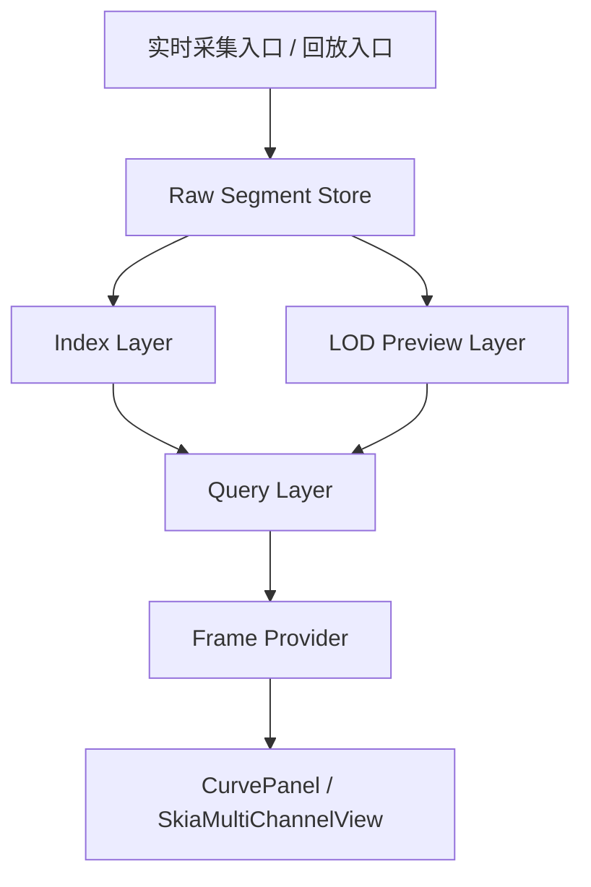

# 实时显示与回放查询架构方案（显示侧专项）

**项目定位**：面向甲方 SDK 回调采集场景的实时曲线显示、历史回放与预览查询一体化方案  
**技术栈约束**：Avalonia + .NET 6 + C#，需兼容 Win7 部署环境  
**文档用途**：显示侧架构设计、模块边界定义、后续与采集/存储模块对接的统一依据  
**文档版本**：v1.0  
**日期**：2026-04-22

---

## 1. 设计目标

### 1.1 必须满足的目标

1. 支持结果页 `1`、`16`、`64` 视图布局。
2. 支持每个视图独立勾选通道、独立缩放、独立交互。
3. 实时显示链路以 `5ms` 刷新节拍为目标，理论上限按 `200Hz` 设计。
4. 验收底线必须满足：
   - `1V-64C >= 80 FPS`
   - `64V-64C >= 60 FPS`
5. 验收含义必须明确：
   - 目标是在**每条曲线真实点数大于等于 `4000`** 时，仍然满足帧率指标
   - 不允许通过“先把每条曲线压到 `4000` 点以内”来换取达标
6. 实时显示与历史回放必须共享同一套查询模型，避免两套显示链路长期分裂。
7. 所有降采样必须保住异常值、毛刺、尖峰和边沿信息。
8. 后续必须支撑 TB 级原始数据回放与快速定位。
9. UI 不得直接阻塞 SDK callback、原始写盘或后台预览构建。
10. 历史回放默认采用单浏览视图，不要求回放阶段保留实时结果页的多视图布局。

### 1.2 明确不做的内容

1. 不通过“把 64 个视图合并成单大视图”来换取性能。
2. 不让 UI 直接响应每一次底层数据更新事件。
3. 不让显示层直接整通道读取 TDMS/HDF5 文件。
4. 不允许不同控件各自实现一套不一致的降采样逻辑。
5. 不依赖模拟数据高度重复、波形高度平滑等前提做架构假设。

---

## 2. 关键约束

### 2.1 视图独立性约束

结果页中的每个视图都必须是独立显示单元，必须支持：

- 独立通道集合
- 独立缩放状态
- 独立 sweep 状态
- 独立 Y 轴策略
- 独立交互与选中状态

该约束意味着：

- 可以统一数据访问层
- 可以统一预览构建层
- 但不能把最终视图语义做成“全局共享一个大视图”

### 2.2 刷新节拍约束

显示链路目标节拍仍然是 `5ms`。

需要区分两个概念：

1. **数据块粒度**
   - 采集与写盘使用的逻辑块粒度
   - 可以按 callback 粒度或轻量聚合粒度组织

2. **UI 刷新节拍**
   - 结果页尝试更新的节拍
   - 目标仍然是 `5ms`

后续架构必须保证：

- 内部数据组织可以按块进行
- UI 仍然保留向 `200Hz` 逼近的能力

### 2.3 降采样语义约束

只要发生降采样，就必须采用包络语义。

要求：

- 优先保 `min`
- 优先保 `max`
- 不允许用简单均值代表整个 bucket
- 不允许为了平滑观感牺牲异常值可见性

该约束适用于：

- 实时预览
- 多级预览
- 历史回放概览
- 窗口限点

### 2.4 验收指标语义约束

当前项目必须统一以下口径：

1. `4000` 表示验收参考点数规模，不表示“每条曲线最多只显示 `4000` 点”。
2. 当单条曲线真实点数超过 `4000` 时，系统仍必须继续显示真实进度，不允许把 `4000` 当作硬截断上限。
3. 允许存在：
   - 原始缓存预算
   - 窗口历史预算
   - renderer 最终绘制预算
   但这些预算不得冒充“真实点数”或“验收点数”。
4. 性能优化不得依赖“先把点数压到 `4000` 以下再测 FPS”。
5. 指标展示必须能够区分：
   - 每曲线真实点数
   - 每曲线显示点数
   - 总点数

### 2.5 回放能力约束

后续必须支持：

- 按时间范围读取
- 按通道集合读取
- 按 segment 定位
- session 打开后默认展示全时长总览
- 鼠标滚轮逐级放大
- 最细浏览到 `2s` 视窗
- 多级预览与原始数据切换

这意味着显示层架构不能建立在：

- “把整个通道一次性读进内存”
- “每次回放都扫完整个文件”

这样的读取方式上。

### 2.5.1 回放浏览语义约束

历史回放必须满足以下浏览语义：

1. 首屏打开不是“播放”，而是“摘要栏式总览”。
2. 默认显示当前 session 的全时长概览。
3. 用户通过鼠标滚轮逐级放大后，系统按视窗大小自动选择合适的 preview 层。
4. `2s` 视窗仍然默认优先使用 preview 层，而不是直接退回原始层。
5. 首屏总览的目标延迟为 `1s` 内。

### 2.6 时间轴语义必须统一

后续架构必须只保留一套对显示层有效的时间轴语义。

允许底层同时存在的时间相关字段可以包括：

- `StartSampleIndex`
- `DeviceTimestampNs`
- `HostTimestampNs`

但显示层与查询层最终对外只能统一成一种窗口时间语义。

建议统一规则：

1. `Raw Storage Layer`
   - 保留原始设备时间、主机接收时间、样本序号
2. `Index Layer`
   - 以可排序、可定位的单一时间轴建立索引
3. `Query Layer`
   - 对 UI 统一暴露 `WindowStart / WindowEnd`
   - UI 不再关心底层到底是基于 sample index 还是 device timestamp 推导

如果这一点不统一，后续极易出现：

- 实时显示一套时间轴
- 历史回放一套时间轴
- 存储索引又一套时间轴

这会直接破坏：

- 时间窗定位
- 快速跳转
- 实时/回放一致性

### 2.7 快照必须显式表达状态

查询层返回给 UI 的结果不能只是“点数组”，必须显式表达当前快照状态。

最低要求：

- 必须能区分“实时快照”与“历史快照”
- 必须能区分“原始层结果”与“预览层结果”
- 必须能区分“完整结果”与“降级结果”
- 必须能区分“正常结果”与“恢复结果”

否则后续在以下场景里，UI 无法可靠判断自己拿到的是什么：

- 首次快速打开历史会话
- 崩溃恢复后的会话
- 预览文件尚未构建完成
- 实时链处于高压降级状态

---

## 3. 当前问题

### 3.1 `DataBus` 职责过重

当前 `DataBus` 同时承担：

- 数据入口
- 预览点生成
- UI 事件源

问题：

- 原始数据与显示数据混在一层
- 预览策略写死
- 不利于后续扩展到历史回放

### 3.2 `RealtimeDisplayCache` 只是单层显示缓存

当前缓存更像“最近点数组快照”。

问题：

- 不支持多级分辨率
- 不支持按时间范围查询
- 不支持实时链与回放链统一访问

### 3.3 `CurvePanel` 参与了过多数据逻辑

当前 `CurvePanel` 内部仍然承担：

- 窗口预算
- 历史预算
- 限点策略
- 数据裁剪逻辑

问题：

- 视图层与数据层耦合
- 难以迁移到回放场景
- 多视图和单视图难以共享统一查询模型

### 3.4 历史读取接口不适合 TB 级回放

当前历史读取更偏向整通道读取。

问题：

- 小文件可用
- 大文件回放不可扩展
- 读取延迟不可控

### 3.5 性能瓶颈本质是调度与重建链问题

从近期多轮日志看，当前结果页的主要问题不是硬件已经跑满，而是：

- 数据更新事件频率过高
- 视图重建频率过高
- 查询和缓存重建不稳定
- 每个 panel 各自走一套数据访问和渲染链

表现为：

- `64V-64C` 帧率低
- CPU/GPU 占用并不高

结论：

**当前主要矛盾是架构层的调度与数据分层问题。**

---

## 4. 总体架构

### 4.1 显示侧总体结构



### 4.2 核心思想

1. 原始数据与预览数据分层。
2. 预览构建与 UI 渲染分层。
3. 实时链与回放链共用查询层。
4. UI 只消费查询结果，不直接处理底层存储细节。
5. 持久化 preview 必须在采集或转换时同步生成，不能依赖“回放打开时再临时重建”。

---

## 5. 模块分层

### 5.1 Ingest Layer：数据接入层

职责：

- 接 SDK callback
- 接历史回放读取流
- 接外部文件回放请求

只负责：

- 形成标准化 `DataBlock`
- 进入后续存储与预览链路

不负责：

- UI 刷新
- 预览绘制
- 视图状态管理

建议接口：

```csharp
public interface IRealtimeDataIngress { }
public interface IReplayDataIngress { }
```

### 5.2 Raw Storage Layer：原始块存储层

职责：

- 保存原始样本块
- 支持 segment 化写入
- 支持 segment 化读取
- 输出会话级元数据
- 为预览层与索引层提供稳定的数据来源

建议接口：

```csharp
public interface IRawSegmentStore { }
public interface IRawSegmentReader { }
```

要求：

- 面向 block / segment
- 不面向 UI 点数组
- 不允许 UI 直接绕过查询层访问原始层

### 5.3 Index Layer：索引层

职责：

- 时间范围定位
- segment 定位
- 通道范围定位
- session 元数据管理
- 快速打开历史会话
- 支撑预览层与回放层的低成本定位

建议接口：

```csharp
public interface IDataSessionCatalog { }
public interface IChannelTimeIndex { }
public interface IReplayLocator { }
```

### 5.4 LOD Preview Layer：多级预览层

职责：

- 构建多级预览
- 统一实现包络降采样
- 为不同显示场景提供不同层级数据

建议层级：

- `L0`：原始层，不降采样
- `L1`：单视图高保真预览
- `L2`：多视图总览预览

必要时可继续扩展更粗层级。

建议接口：

```csharp
public interface IPreviewPyramidStore { }
public interface IPreviewLevelBuilder { }
public interface IEnvelopeDownsampler { }
```

### 5.4.1 预览层构建策略必须明确

预览层后续不能只定义“有 L0/L1/L2”，还必须明确它们的构建时机。

建议采用三类构建策略：

1. **同步构建**
   - 仅适用于实时链中最靠近当前时间窗、且计算成本可控的预览层
   - 目标是保证实时显示有稳定、低延迟的最新预览

2. **异步增量构建**
   - 适用于历史会话预览文件的后台补齐
   - 目标是在不阻塞主链路的前提下，持续完善历史预览层

3. **懒构建**
   - 适用于历史首次打开但对应预览层尚不存在的场景
   - 只对请求时间窗相关 segment 进行局部构建，不允许整会话全量重建

建议默认策略：

- 实时链：
  - 最近窗口的轻量预览层同步构建
- 历史链：
  - 会话级预览优先读取已有文件
  - 缺失时按 segment 局部懒构建
  - 后台异步补齐完整预览层

如果不提前写清这一点，后续实现时最容易出现：

- 写盘线程顺手做太多预览工作
- 首次打开历史时触发整会话重建
- 实时链和历史链各自发明一套构建时机

### 5.5 Query Layer：统一查询层

职责：

- 给 UI 提供统一数据访问接口
- 对实时链和回放链屏蔽底层差异
- 返回统一窗口快照模型

建议接口：

```csharp
public interface ICurveQueryService
{
    ValueTask<CurveWindowSnapshot> QueryAsync(PreviewReadRequest request, CancellationToken ct = default);
}

public interface ICurveFrameProvider
{
    CurveFrameVersion GetLatestVersion(Guid sessionId);
    ValueTask<CurveWindowSnapshot> GetLatestAsync(PreviewReadRequest request, CancellationToken ct = default);
}
```

### 5.6 UI Render Layer：UI 渲染层

职责：

- `CurvePanel`
- `SkiaMultiChannelView`
- 视图交互
- 视图状态管理

只负责：

- 消费查询结果
- 执行交互
- 维护局部视图状态

不负责：

- 原始数据扫描
- 多级预览构建
- 整文件读取

---

## 6. 实时链与回放链统一方式

### 6.1 实时链

实时链推荐流程：

SDK callback  
-> `DataBlock`  
-> 原始写盘  
-> 更新最近原始缓存  
-> 更新最近预览缓存  
-> 查询层对 UI 提供“最新版本”

### 6.2 历史回放链

历史回放推荐流程：

Session / Catalog / Index 定位  
-> segment 范围读取  
-> 原始块或预览块读取  
-> 查询层返回统一 `CurveWindowSnapshot`

### 6.3 统一后的好处

统一后，UI 不需要区分：

- 这份数据来自 SDK 实时链
- 还是来自 TDMS/HDF5 历史回放

它只知道：

- 当前视图请求了什么时间窗
- 查询层返回了什么层级的数据

### 6.4 与存储体系的关系

这套统一架构不是“只给显示用”的附加层，而是必须和存储体系一起设计。

原因：

1. 实时链的数据最终会落成 segment 文件；
2. 历史回放的数据来源将是这些 segment 文件及其 sidecar 索引；
3. 如果查询层与预览层不考虑存储组织，后续 UI 就一定会退化成直接扫文件。

因此这里的统一架构必须默认依赖以下事实：

- 原始数据按 segment 持续写盘；
- 会话必须有 `manifest`；
- 会话必须有 `catalog`；
- 通道和时间范围必须有 sidecar 索引；
- 多级预览应作为可持久化产物参与会话组织，而不是仅存在于运行期内存里。

---

## 7. 推荐的对象模型

建议后续统一采用以下核心对象：

- `SessionDescriptor`
- `SourceDescriptor`
- `SegmentDescriptor`
- `DataBlockHeader`
- `RawReadRequest`
- `PreviewReadRequest`
- `CurveWindowSnapshot`
- `CurveFrameVersion`
- `PreviewLevel`

### 7.1 `CurveWindowSnapshot` 建议字段

建议至少包含：

- `SessionId`
- `ViewId`
- `ChannelIds`
- `WindowStart`
- `WindowEnd`
- `PreviewLevel`
- `Version`
- `ChannelData`
- `MaxActualPointsPerChannel`
- `TotalActualPoints`
- `DataEpoch`
- `SourceVersion`
- `SegmentRange`
- `IsPreview`
- `IsComplete`
- `BuildState`
- `Recovered`
- `TimeAxisKind`

### 7.1.1 `CurveWindowSnapshot` 字段语义要求

建议进一步明确：

- `Version`
  - 当前查询结果版本号，用于 UI 判定是否需要更新
- `DataEpoch`
  - 数据时间轴纪元；当时间基准整体重置时必须变化
- `SourceVersion`
  - 底层原始数据版本或来源版本
- `SegmentRange`
  - 当前窗口实际覆盖的 segment 范围
- `IsPreview`
  - 当前返回是否来自预览层
- `IsComplete`
  - 当前结果是否完整覆盖请求窗口
- `BuildState`
  - 例如 `Ready / Building / Degraded / Missing`
- `Recovered`
  - 当前会话是否来自异常恢复
- `TimeAxisKind`
  - 当前窗口时间轴语义，例如 `DeviceTime / HostTime / SampleIndexMappedTime`

这组字段的目的不是“增加复杂度”，而是确保 UI 在以下场景下有明确判断依据：

- 是实时还是回放
- 是完整数据还是降级数据
- 是原始层还是预览层
- 当前时间轴口径是否发生过切换

### 7.2 `PreviewReadRequest` 建议字段

建议至少包含：

- `SessionId`
- `SourceIds`
- `ChannelIds`
- `WindowStart`
- `WindowEnd`
- `PreviewLevel`
- `MaxPointsPerChannel`
- `RequireEnvelopeSemantics`
- `PreferredTimeAxisKind`
- `AllowDegradedResult`
- `RequireCompleteWindow`
- `RequestedSourceVersion`

---

## 8. 缓存与数据访问策略

### 8.1 最近原始缓存

建议新增：

- `RecentRawWindowCache`

用途：

- 最近几秒原始块快速读取
- 处理链短窗回看
- 异常波形快速追溯

### 8.2 最近预览缓存

建议新增：

- `RecentPreviewWindowCache`

用途：

- 高频实时显示
- UI 快速拉取最新版本
- 避免每个 panel 自己重建预览

### 8.3 预览缓存不是原始数据存储

必须明确：

- 预览缓存可以过期、可重建
- 原始数据存储是权威数据源
- 预览层只是为了显示效率，不应代替原始层

### 8.4 预览缓存与持久化预览文件的关系

需要区分两类预览：

1. **运行期预览缓存**
   - 面向当前实时显示
   - 生命周期短
   - 可直接丢弃和重建

2. **会话级预览文件**
   - 面向历史快速打开
   - 与会话目录一起持久化
   - 可按层级组织为 `L1/L2/...`

建议原则：

- 实时链优先使用运行期缓存；
- 历史打开优先使用会话级预览文件；
- 两者都必须遵守同一套包络线语义。

---

## 9. 历史文件读取约束

### 9.1 读取侧最低要求

无论最终主格式是 TDMS 还是 HDF5，读取侧都必须支持：

- 按时间范围读取
- 按 segment 读取
- 按通道集合读取
- 按预览层级读取

### 9.2 不推荐的默认方式

后续不应再把下面这种方式当成默认路径：

- 整个通道 `GetData<T>()`
- 整段 `ToArray()`
- 再交给 UI 做裁剪

这只适合小文件，不适合 TB 级历史回放。

### 9.3 建议接口

建议拆成：

- `ITdmsRangeReader`
- `ITdmsChannelCatalog`
- `ITdmsPreviewReader`

如果未来不是 TDMS，也应该有对等抽象，而不是把 UI 绑死在某个文件 API 上。

---

## 10. 多级目录与索引结构

推荐目录结构：

```text
Data/
  sessions/
    20260422/
      210036/
        manifest.json
        devices/
          device-0001/
            channels/
              ch-0001/
                raw/
                  seg-000001.bin
                  seg-000002.bin
                lod/
                  l1/
                    seg-000001.lod
                  l2/
                    seg-000001.lod
                index/
                  channel.index
                  time.index
```

说明：

- `manifest.json`
  - 记录会话元数据
- `raw/`
  - 原始数据块
- `lod/`
  - 多级包络预览
- `index/`
  - 快速定位索引

如果继续使用 TDMS/HDF5：

- 文件本身负责原始会话数据
- sidecar 索引和预览文件负责快速检索与快速显示

### 10.1 `manifest.json` 最低要求

建议至少记录：

- `SessionId`
- `TaskName`
- `StartTime`
- `EndTime`
- `StorageFormat`
- `PreviewLevels`
- `SourceCount`
- `ChannelMap`
- `SegmentPolicy`
- `RecoveredState`

### 10.2 `session.catalog.db` 最低要求

建议至少记录：

- 每个 segment 的路径
- segment 起止时间
- segment 起止 sample range
- source / channel 范围
- raw / preview 对应关系
- 文件是否完整关闭

### 10.3 快速打开路径

历史会话打开时，不应执行：

- 遍历整个目录树
- 打开并扫描所有大文件
- 整通道读取后再建视图

推荐默认路径：

1. 读取 `manifest.json`
2. 打开 `session.catalog.db`
3. 加载 `channel.index` / `time.index`
4. 根据视图请求决定读取：
   - 原始层
   - `L1`
   - `L2`
5. 返回统一 `CurveWindowSnapshot`

这条路径应成为 TB 级历史回放的标准打开流程。

---

## 11. 模块边界建议

### 11.1 采集与写盘侧主责

建议主责：

- `Ingest Layer`
- `Raw Storage Layer`
- `Index Layer`
- `Session / Source / Block / Segment` 生命周期

### 11.2 显示与回放侧主责

建议主责：

- `LOD Preview Layer`
- `Query Layer`
- `UI Render Layer`

### 11.3 必须统一的公共边界

建议双方统一：

- 对象模型
- 查询请求模型
- 快照模型
- 预览层级定义

否则最后合并时最容易发生概念级冲突。

---

## 12. 推荐改造顺序

### 第一步：定义统一查询接口

先冻结：

- `ICurveQueryService`
- `ICurveFrameProvider`
- `CurveWindowSnapshot`
- `PreviewReadRequest`

### 第二步：让 UI 只依赖查询层

让 `CurvePanel` 和 `SkiaMultiChannelView` 不再直接依赖：

- `DataBus`
- `RealtimeDisplayCache`
- `TdmsReaderUtil`

这一阶段必须特别注意：

- 旧的事件驱动 UI 链路不能长期与新的查询链路并存
- 必须明确哪些路径先迁移、哪些路径先冻结

建议迁移原则：

1. 先保留旧链路只作为兼容兜底
2. 新链路一旦覆盖某类查询场景，旧链路立即退化为只读兼容或直接下线
3. 不允许同一个视图同时依赖：
   - 事件推式更新
   - 查询拉式更新

否则最容易出现：

- 双重重建
- 版本判断混乱
- 实时链和回放链结果不一致

### 第三步：实现多级预览层

统一落地：

- 包络线降采样
- 多级预览缓存
- 最近窗口缓存
- 会话级预览文件组织

### 第四步：让实时链与回放链都接入查询层

做到：

- 实时显示和历史回放共用窗口查询能力
- UI 不再关心底层来源

### 第五步：补齐目录与索引侧的快速读取能力

最终让 TB 级回放真正可用。

### 第六步：让存储格式与查询层完全解耦

做到：

- UI 不关心底层是 TDMS 还是 HDF5
- 查询层只依赖统一 reader / catalog / index 接口
- 替换底层存储格式不会迫使 UI 大面积改动

### 第七步：正式移除旧的直连数据访问链

这一阶段的目标是明确收口：

- `CurvePanel` 不再直接向 `DataBus` 拉取窗口数据
- `CurvePanel` 不再直接依赖 `RealtimeDisplayCache` 的实现细节
- `TdmsReaderUtil` 不再作为 UI 层默认读取入口

迁移完成标志应包括：

1. UI 所有实时窗口查询只走 `ICurveFrameProvider`
2. UI 所有历史窗口查询只走 `ICurveQueryService`
3. 旧链路仅保留在内部适配层，不再直接暴露给视图层

---

## 13. 关键结论

这份架构补充的核心结论是：

1. 实时显示、原始存储、历史回放不能再分别长成三套体系。
2. 必须通过“原始层 + 预览层 + 查询层 + UI 层”的分层把职责拆开。
3. `5ms / 200Hz`、`64` 个独立视图、包络线异常保真，这三条必须同时成立。
4. 后续如果要支持 TB 级回放，读取侧必须从整通道读法升级为范围读取、segment 读取和预览层级读取。
5. 存储目录、manifest/catalog、sidecar 索引和预览层级文件必须从一开始按快速打开目标设计。
6. 查询层是连接“原始存储”和“独立视图渲染”的唯一合理边界，不应再由 UI 直接跨层访问底层数据。

这部分建议视为本方案后续落地时的正式约束，而不是可选增强项。
